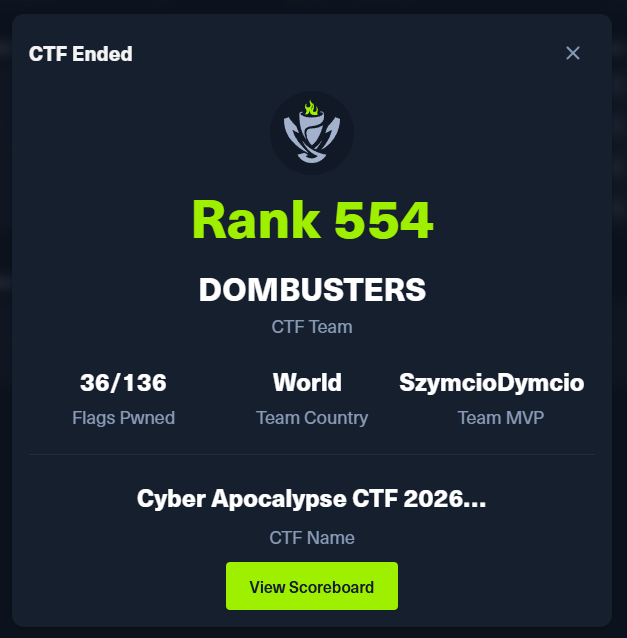
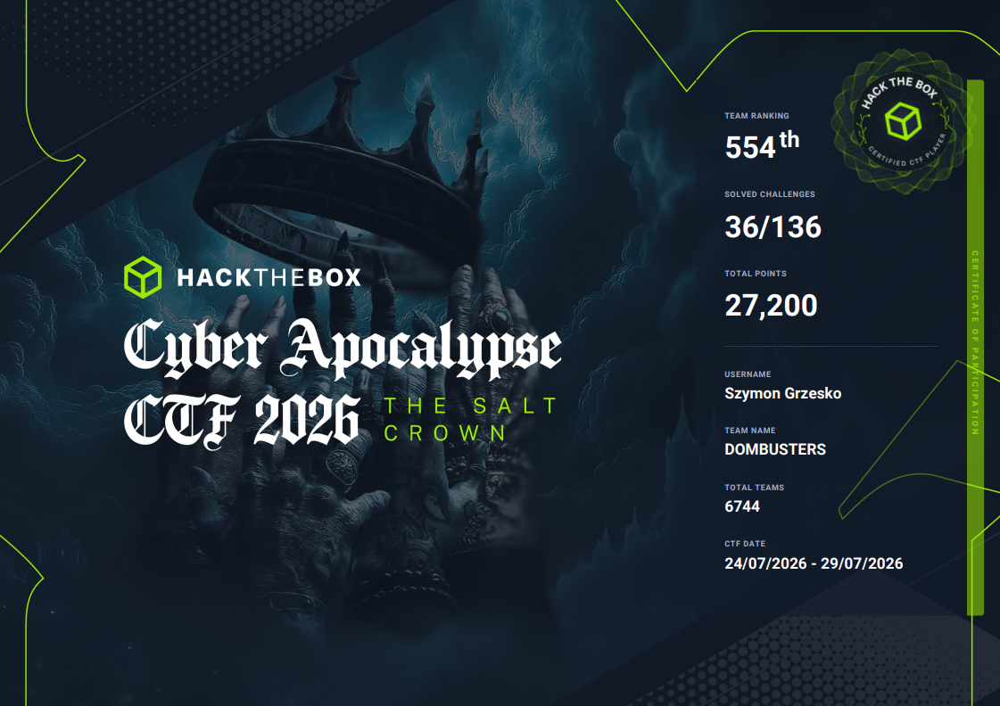

> **📌 Event Summary**
>
> **Platform:** Hack The Box  
> **Event:** Cyber Apocalypse CTF 2026: The Salt Crown  
> **Duration:** 24 July – 29 July 2026  
> **Team:** DOMBUSTERS  
> **Final Ranking:** **554 / 6,744 teams** *(Top ~8%)*  
> **Flags Captured:** **36 / 136**  
> **Result:** 🏆 Team MVP

For the past few months, I had been solving Hack The Box machines and individual challenges whenever I had some free time. However, Cyber Apocalypse CTF 2026: The Salt Crown was the first Capture The Flag competition that I decided to take seriously from start to finish.

The event ran from **24 July until 29 July 2026** and featured **74 scenarios**, **136 flags**, across **16 different categories**, ranging from Web Security and Reverse Engineering to AI/ML, Hardware, ICS, Blockchain, and even Quantum Security.

What made this event stand out was its fantasy-inspired storyline. Every challenge was connected to the world of The Salt Crown, making the competition feel much more immersive.

## Competing with DOMBUSTERS

I participated together with my Hack The Box team, DOMBUSTERS, which is currently ranked 16th on the main platform. Although our team has many members, only three of us participated during the event.

Both of my teammates have significantly more CTF experience than I do. While they were always willing to help, I intentionally tried to solve as many challenges as possible on my own. Even if it meant solving fewer flags, I knew that struggling through the challenges myself would teach me much more.

By the end of the competition, we captured **36 out of 136** flags and finished 554th out of 6,744 teams, placing us in roughly the **top 8%** of all participating teams.

According to the scoreboard, I finished as the team's **MVP**. While that sounds impressive, I do not think it tells the full story. Most of my points came from solving a large number of easier challenges, while my teammates completed some incredibly difficult challenges that required far more experience and persistence.

## Day One: Chasing the Leaderboard

Like many first-time competitors, I started the event with one goal: solve as many challenges as possible before everyone else.

I began with the OSINT category because it relies more on research and attention to detail than advanced technical exploitation. The challenges were surprisingly enjoyable, and I managed to complete the entire category fairly quickly.

Feeling confident, I moved on to the Web category. Since web security is one of my favourite areas, I expected it to go well. I started working on one of the easy web challenges, only to find out later that one of my teammates had been solving the exact same challenge. He finished it before I did, so I switched to one of the medium challenges instead.

That decision cost me several hours.

That challenge turned out to be much harder than I expected. I kept trying different approaches but never managed to solve it. Looking back after the competition, I realized that even the Easy web challenges had relatively few solves compared to most other categories. Looking back, it made a lot more sense why I got stuck for so long.

## Reverse Engineering Practice

During the following days I focused mainly on **Reverse Engineering** and **Forensics**.

This turned out to be excellent preparation because I have a reverse engineering resit exam coming up. The reversing challenges were considerably more difficult than the ones I had previously completed on the regular Hack The Box platform.

Although I only solved two reversing challenges, I spent many hours analysing binaries with **Ghidra**. By the end of the event, I felt much more confident using the tool and understanding how to approach unfamiliar binaries.

Even though I only solved two challenges, I probably learned the most from this category. The practical experience I gained will definitely help me during my upcoming exam.

The forensic challenges went relatively smoothly as long as I stayed with the easier ones. Whenever I looked at the harder challenges and noticed how few teams had solved them, I sometimes became discouraged. At the time, I felt they were simply beyond my current skill level.

## A Different Kind of Difficulty

One thing that really surprised me was just how difficult the challenges actually were.

Before entering the competition, I expected them to be similar to the standalone Hack The Box challenges I had already completed. Instead, I quickly realized that CTF challenges often require combining multiple skills rather than applying a single technique.

Even challenges labelled as **Easy** often demanded far more creativity than I expected.

Looking back, getting stuck was actually part of the experience. Every failed attempt forced me to think differently and ultimately helped me understand new concepts, even when I did not manage to capture the flag.

## Exploring New Areas

After the second day, both of my teammates stopped participating, so I continued working through the remaining challenges on my own.

At that point, I knew we were no longer competing for a top placement, so I decided to use the remaining time to learn instead of chasing points.

I spent some time on the **Coding** challenges to refresh my programming skills after not writing much code recently. I also returned to the web challenge that had frustrated me since day one, hoping I would finally find the missing piece. Unfortunately, I still could not solve it.

Towards the end of the event, I started opening challenges from categories I had never touched before, including **Hardware**, **ICS**, and **AI/ML**.

I could not solve most of them because I simply lacked the required knowledge, but they taught me something even more valuable. They made me realize just how broad cybersecurity really is.

Before this competition, I mainly associated cybersecurity with penetration testing and web applications. Cyber Apocalypse showed me that there are countless different specializations, many of which I had barely heard about before.

## Looking Back

Overall, Cyber Apocalypse CTF 2026 was one of the most enjoyable cybersecurity experiences I have had so far.

What started as a competition quickly became a learning experience. During the first day, I cared mostly about climbing the leaderboard. By the end of the event, I cared much more about understanding the challenges than earning points.

I improved my reverse engineering skills, became much more comfortable using Ghidra, refreshed my programming knowledge, and discovered entirely new areas of cybersecurity that I would like to explore in the future, especially **Industrial Control Systems (ICS)** and **Hardware Security**.

Although I was happy with our final result, I think the biggest achievement was realizing how much there still is to learn. Instead of discouraging me, that motivated me even more.

Finally, it was a nice bonus that every participant received a Hack The Box discount code after the event. However, the experience and everything I learned throughout the week were far more valuable than the reward.

### What's Next?

This was my first serious CTF competition, but definitely not my last. My goal is to participate in more Hack The Box events, improve my reverse engineering skills, and become more comfortable with categories that were completely new to me during this competition, such as Hardware, ICS, and AI/ML.

I'm already looking forward to the next CTF.

