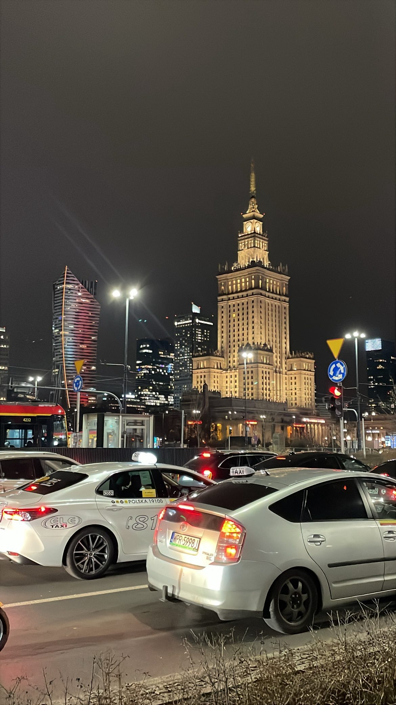
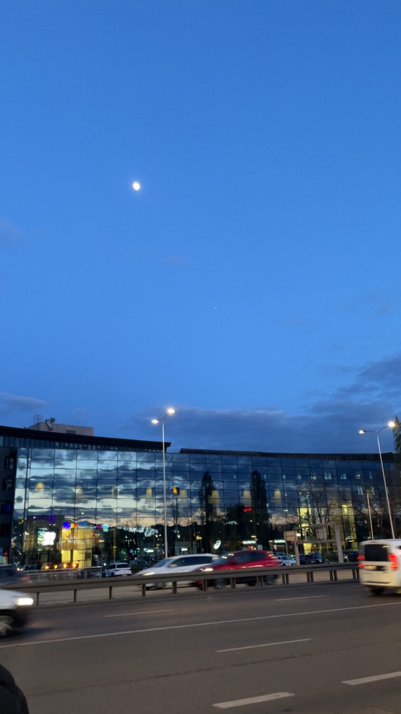

For my internship, I participated in the Erasmus+ programme and went to Warsaw. I am actually originally from Poland, so this was not a typical Erasmus experience where everything feels completely foreign. I was going back to my own country. Still, I cannot say it was not a great experience. It was different from what most students go through, but it was valuable in its own way.

## The Difficult Start

The beginning was not easy. For the first part of my stay, I was living completely alone and I didn't know many people, which felt quite lonely, especially in the evenings. To make things better, I invited some of my friends from Poland to come visit me. Having them around made a huge difference. Once I made some better connections and met new people, everything started to feel much better. Exploring the city and doing things together with friends was honestly amazing.

## Living in Warsaw

Warsaw is such a big city. It felt completely different from Bruges, where I am living now. Here in Bruges, everything is small, quiet, and slow. Warsaw is the opposite. Everything moves so fast. The streets are wide, the buildings are large, and there is always something happening. I know some people do not like that kind of fast-paced environment, but for me, it was not a problem at all. I actually enjoyed it.

In a city that big, there is always something to do. There are so many places to visit, from museums to parks to shopping centres. I was there for three months, and I saw so much. But at the same time, I still feel like I only saw a very small part of the city. That is the thing about Warsaw. It feels endless.

Another good thing for me was that I still have some family in Poland. I could visit them during the weekends. That gave me a sense of home and comfort that many Erasmus students probably do not have.

## The Internship Itself

The most important part of this experience was of course the internship. I worked at URPL, which is a government institution in Warsaw. The company was quite large, around 500 employees. But our IT team was very small, only about 15 people. Within that team, there were three people responsible for cybersecurity, including me.

It was a blue team internship. That is not where my main interests are. I have always been more drawn to other areas of cybersecurity. But I am so glad I got to do this internship because it opened my eyes. Blue team work is not as bad as I thought it would be. It can actually be interesting. It is not just looking at logs all day. There is strategy, analysis, and problem solving involved as well.

There was also a sysadmin part to the internship, which I really liked. Working with systems and keeping them running properly gave me a lot of satisfaction.

## What I Learned

I am aware that there were places where I could have learned more or worked with more advanced technologies. But that does not take away from what I did learn. I enjoyed the atmosphere at URPL. I met really amazing people who gave me many tips for my future career. Those conversations and connections matter just as much as the technical skills.

## Final Thoughts

Going back to Poland for my internship was not the typical Erasmus adventure, but it was still a great experience. I lived in a big city, made new friends, visited family, and learned that blue team work is more interesting than I expected. I would recommend an international internship to anyone, even if you are going back to a place you already know. There is always something new to discover.